The `ascend` package provides a series of tools for the processing and analysis of single cell RNA-seq (scRNA-seq) in R. These tools perform tasks such as filtering, normalisation, clustering and differential expression.

## About the dataset
This dataset comprises of 1272 human embryonic stem cell-derived retinal ganglion cells (RGCs).  The single cell libraries were prepared with the Chromium Single Cell 3' Solution system by 10x Genomics. Two libraries were prepared - one consisting of THY1-positive cells (Batch 1) and THY1-negative cells (Batch 2). Sequence from these two batches were aggregated and batch normalised using 10x Genomics' Cell Ranger Single Cell Software Suite 1.3.1. 

You can read more about this dataset in the paper [Single Cell RNA Sequencing of stem cell-derived retinal ganglion cells][1] by Daniszewski et al. 2017.

## Loading Data for use in ascend
### Preparing data manually
The data for this vignette is included with the package. You can load the data by using the following command:


```r
load(system.file("extdata", "RGC_scRNASeq.RData", package = "ascend"))
```

These objects contain all the information we need to create an `EMSet` - the main data object of the ascend package. 

#### Expression matrix
The main source of input is an expression matrix, or a gene-cell matrix where each row represents a transcript and each column represents a cell. Cell Ranger - the processing pipeline for the Chromium platform, has stored the expression matrix in a Market Exchange Format (MEX) file called `matrix.mtx`. This was read into R with the `readMM` function from the `Matrix` package.

Let's have a look at a small part of the matrix.


```r
matrix <- as.data.frame(as.matrix(matrix))
matrix[1:5,1:5]
```

```
##   V1 V2 V3 V4 V5
## 1  0  0  0  0  0
## 2  0  0  0  0  0
## 3  0  0  0  0  0
## 4  0  0  0  0  0
## 5  0  0  0  0  0
```

`readMM` reads the data in as a sparse matrix, using less memory than data frames and matrices. The expression matrix can be kept in this format, but as we want to view the contents of the matrix for this tutorial – we have converted it into a data frame.  This data frame lacks row and column labels as Cell Ranger has stored them in the two other files - `barcodes.tsv` and `genes.tsv`.

#### Preparing Cell Information
`barcodes.tsv` is a CSV file containing cell identifier and batch information. Chromium uses actual cell barcodes as cell identifiers and has attached a number to each barcode. This number represents the batch the cell originated from.


```r
barcodes[1:5,]
```

```
## [1] AAACCTGAGCTGTTCA-1 AAACCTGCAATTCCTT-1 AAACCTGGTCTACCTC-1
## [4] AAACCTGTCGGAGCAA-1 AAACGGGAGTCGATAA-1
## 1272 Levels: AAACCTGAGACCACGA-2 AAACCTGAGCTGTTCA-1 ... TTTGTCATCTTCATGT-2
```

Extract the batch numbers from the cell identifiers by splitting each string at the '-' symbol and retrieve the second part of the string.


```r
batch.information <- unlist(as.numeric(lapply(strsplit(as.character(barcodes$V1), "-"), `[`, 2)))
batch.information[1:5]
```

```
## [1] 1 1 1 1 1
```

Add this batch information to the barcodes data frame, which will become our Cell Information dataframe.


```r
colnames(barcodes) <- c("cell_barcode")
barcodes$batch <- as.numeric(batch.information)
barcodes[1:5,]
```

```
##         cell_barcode batch
## 1 AAACCTGAGCTGTTCA-1     1
## 2 AAACCTGCAATTCCTT-1     1
## 3 AAACCTGGTCTACCTC-1     1
## 4 AAACCTGTCGGAGCAA-1     1
## 5 AAACGGGAGTCGATAA-1     1
```

Finally, add the cell identifiers to the expression matrix as column names.


```r
colnames(matrix) <- barcodes[,1]
matrix[1:5, 1:5]
```

```
##   AAACCTGAGCTGTTCA-1 AAACCTGCAATTCCTT-1 AAACCTGGTCTACCTC-1
## 1                  0                  0                  0
## 2                  0                  0                  0
## 3                  0                  0                  0
## 4                  0                  0                  0
## 5                  0                  0                  0
##   AAACCTGTCGGAGCAA-1 AAACGGGAGTCGATAA-1
## 1                  0                  0
## 2                  0                  0
## 3                  0                  0
## 4                  0                  0
## 5                  0                  0
```

#### Gene Information
`genes.tsv` contains the names of transcripts identified by Cell Ranger. This csv file contains ENSEMBL transcript IDs in one column and their corresponding gene name in the other column. Either of these identifiers can be used as row names in the expression matrix. 


```r
colnames(genes) <- c("ensembl_id", "gene_symbol")
genes[1:5,]
```

```
##        ensembl_id  gene_symbol
## 1 ENSG00000243485    MIR1302-2
## 2 ENSG00000237613      FAM138A
## 3 ENSG00000186092        OR4F5
## 4 ENSG00000238009 RP11-34P13.7
## 5 ENSG00000239945 RP11-34P13.8
```

For this tutorial, we will use gene names. As genes can be associated with more than one transcript, we need to make the names unique with `make.unique` before adding them to the expression matrix. We also need to swap the order of the identifiers, as ascend requires our chosen names to be in the first column of the Gene Information dataframe.


```r
genes <- genes[,c("gene_symbol", "ensembl_id")]
gene.names <- make.unique(as.vector(genes$gene_symbol))
rownames(matrix) <- gene.names
matrix[1:5, 1:5]
```

```
##              AAACCTGAGCTGTTCA-1 AAACCTGCAATTCCTT-1 AAACCTGGTCTACCTC-1
## MIR1302-2                     0                  0                  0
## FAM138A                       0                  0                  0
## OR4F5                         0                  0                  0
## RP11-34P13.7                  0                  0                  0
## RP11-34P13.8                  0                  0                  0
##              AAACCTGTCGGAGCAA-1 AAACGGGAGTCGATAA-1
## MIR1302-2                     0                  0
## FAM138A                       0                  0
## OR4F5                         0                  0
## RP11-34P13.7                  0                  0
## RP11-34P13.8                  0                  0
```

Now that the gene names have been modified, the gene_names column in the `genes` data frame needs to be updated. This will link the information in this data frame with the rows of the expression matrix.


```r
genes$gene_symbol <- gene.names
genes[1:15,]
```

```
##      gene_symbol      ensembl_id
## 1      MIR1302-2 ENSG00000243485
## 2        FAM138A ENSG00000237613
## 3          OR4F5 ENSG00000186092
## 4   RP11-34P13.7 ENSG00000238009
## 5   RP11-34P13.8 ENSG00000239945
## 6  RP11-34P13.14 ENSG00000239906
## 7   RP11-34P13.9 ENSG00000241599
## 8     FO538757.2 ENSG00000279928
## 9     FO538757.1 ENSG00000279457
## 10    AP006222.2 ENSG00000228463
## 11 RP5-857K21.15 ENSG00000236743
## 12  RP4-669L17.2 ENSG00000236601
## 13 RP4-669L17.10 ENSG00000237094
## 14        OR4F29 ENSG00000278566
## 15  RP5-857K21.4 ENSG00000230021
```

#### Defining Controls
Finally, we need to identify controls for this experiment. Ribosomal and mitochondrial genes are typically used as controls for single-cell experiments, so will use these genes for the tutorial. Spike-ins should be used as controls if they are included in the experiment.

We are using a quick method of identifying mitochondrial and ribosomal genes, by using the `grep` function to identify these genes by their prefix. 

```r
mito.genes <- rownames(matrix)[grep("^MT-", rownames(matrix), 
                                    ignore.case = TRUE)]
ribo.genes <- rownames(matrix)[grep("^RPS|^RPL", 
                                    rownames(matrix), 
                                    ignore.case = TRUE)]
controls <- list(Mt = mito.genes, Rb = ribo.genes)
controls
```

```
## $Mt
##  [1] "MT-ND1"  "MT-ND2"  "MT-CO1"  "MT-CO2"  "MT-ATP8" "MT-ATP6" "MT-CO3" 
##  [8] "MT-ND3"  "MT-ND4L" "MT-ND4"  "MT-ND5"  "MT-ND6"  "MT-CYB" 
## 
## $Rb
##   [1] "RPL22"          "RPL11"          "RPS6KA1"        "RPS8"          
##   [5] "RPL5"           "RPS27"          "RPS6KC1"        "RPS7"          
##   [9] "RPS27A"         "RPL31"          "RPL37A"         "RPL32"         
##  [13] "RPL15"          "RPSA"           "RPL14"          "RPL29"         
##  [17] "RPL24"          "RPL22L1"        "RPL39L"         "RPL35A"        
##  [21] "RPL9"           "RPL34-AS1"      "RPL34"          "RPS3A"         
##  [25] "RPL37"          "RPS23"          "RPS14"          "RPL26L1"       
##  [29] "RPS18"          "RPS10-NUDT3"    "RPS10"          "RPL10A"        
##  [33] "RPL7L1"         "RPS12"          "RPS6KA2"        "RPS6KA2-AS1"   
##  [37] "RPS6KA3"        "RPS4X"          "RPS6KA6"        "RPL36A"        
##  [41] "RPL36A-HNRNPH2" "RPL39"          "RPL10"          "RPS20"         
##  [45] "RPL7"           "RPL30"          "RPL8"           "RPS6"          
##  [49] "RPL35"          "RPL12"          "RPL7A"          "RPLP2"         
##  [53] "RPL27A"         "RPS13"          "RPS6KA4"        "RPS6KB2"       
##  [57] "RPS3"           "RPS25"          "RPS24"          "RPS26"         
##  [61] "RPL41"          "RPL6"           "RPLP0"          "RPL21"         
##  [65] "RPL10L"         "RPS29"          "RPL36AL"        "RPS6KL1"       
##  [69] "RPS6KA5"        "RPS27L"         "RPL4"           "RPLP1"         
##  [73] "RPS17"          "RPL3L"          "RPS2"           "RPS15A"        
##  [77] "RPL13"          "RPL26"          "RPL23A"         "RPL23"         
##  [81] "RPL19"          "RPL27"          "RPS6KB1"        "RPL38"         
##  [85] "RPL17-C18orf32" "RPL17"          "RPS21"          "RPS15"         
##  [89] "RPL36"          "RPS28"          "RPL18A"         "RPS16"         
##  [93] "RPS19"          "RPL18"          "RPL13A"         "RPS11"         
##  [97] "RPS9"           "RPL28"          "RPS5"           "RPS4Y1"        
## [101] "RPS4Y2"         "RPL3"           "RPS19BP1"
```

#### Building an EMSet
We can now load all of this information into an `EMSet`, using the `NewEMSet` function. To view information about this object, enter the name of the object into the console.


```r
em.set <- NewEMSet(ExpressionMatrix = matrix, GeneInformation = genes, 
                   CellInformation = barcodes, Controls = controls)
```

```
## [1] "Calculating control metrics..."
## 
  |                                                                       
  |                                                                 |   0%
  |                                                                       
  |================================                                 |  50%
  |                                                                       
  |=================================================================| 100%
```

```r
em.set
```

```
## [1] "ascend Object - EMSet"
## [1] "Expression Matrix: 33020 genes and 1272 cells"
## [1] "Controls:"
## $Mt
##  [1] "MT-ND1"  "MT-ND2"  "MT-CO1"  "MT-CO2"  "MT-ATP8" "MT-ATP6" "MT-CO3" 
##  [8] "MT-ND3"  "MT-ND4L" "MT-ND4"  "MT-ND5"  "MT-ND6"  "MT-CYB" 
## 
## $Rb
##   [1] "RPL22"          "RPL11"          "RPS6KA1"        "RPS8"          
##   [5] "RPL5"           "RPS27"          "RPS6KC1"        "RPS7"          
##   [9] "RPS27A"         "RPL31"          "RPL37A"         "RPL32"         
##  [13] "RPL15"          "RPSA"           "RPL14"          "RPL29"         
##  [17] "RPL24"          "RPL22L1"        "RPL39L"         "RPL35A"        
##  [21] "RPL9"           "RPL34-AS1"      "RPL34"          "RPS3A"         
##  [25] "RPL37"          "RPS23"          "RPS14"          "RPL26L1"       
##  [29] "RPS18"          "RPS10-NUDT3"    "RPS10"          "RPL10A"        
##  [33] "RPL7L1"         "RPS12"          "RPS6KA2"        "RPS6KA2-AS1"   
##  [37] "RPS6KA3"        "RPS4X"          "RPS6KA6"        "RPL36A"        
##  [41] "RPL36A-HNRNPH2" "RPL39"          "RPL10"          "RPS20"         
##  [45] "RPL7"           "RPL30"          "RPL8"           "RPS6"          
##  [49] "RPL35"          "RPL12"          "RPL7A"          "RPLP2"         
##  [53] "RPL27A"         "RPS13"          "RPS6KA4"        "RPS6KB2"       
##  [57] "RPS3"           "RPS25"          "RPS24"          "RPS26"         
##  [61] "RPL41"          "RPL6"           "RPLP0"          "RPL21"         
##  [65] "RPL10L"         "RPS29"          "RPL36AL"        "RPS6KL1"       
##  [69] "RPS6KA5"        "RPS27L"         "RPL4"           "RPLP1"         
##  [73] "RPS17"          "RPL3L"          "RPS2"           "RPS15A"        
##  [77] "RPL13"          "RPL26"          "RPL23A"         "RPL23"         
##  [81] "RPL19"          "RPL27"          "RPS6KB1"        "RPL38"         
##  [85] "RPL17-C18orf32" "RPL17"          "RPS21"          "RPS15"         
##  [89] "RPL36"          "RPS28"          "RPL18A"         "RPS16"         
##  [93] "RPS19"          "RPL18"          "RPL13A"         "RPS11"         
##  [97] "RPS9"           "RPL28"          "RPS5"           "RPS4Y1"        
## [101] "RPS4Y2"         "RPL3"           "RPS19BP1"
```

### Load data from Cell Ranger into ascend automatically
If you are using Chromium data, you can also load the data into R with the `LoadCellRanger` function. This function loads the data into an EMSet, with the assumption that mitochondrial and ribosomal genes are controls for this experiment.


```r
em.set <- LoadCellRanger("RGC_scRNASeq/", "GRCh38")
```

#### Adding additional metadata to the EMSet
We can add other information to the EMSet after it is created. 

For example, the cells in this dataset were sorted for expression of the THY1 protein. This corresponds to the batch identifiers that we have just pulled out from the barcodes.


```r
cell.info <- GetCellInfo(em.set)
thy1.expression <- cell.info$batch
thy1.expression <- thy1.expression == 1
cell.info$THY1 <- thy1.expression
cell.info[1:5, ]
```

```
##         cell_barcode batch THY1
## 1 AAACCTGAGCTGTTCA-1     1 TRUE
## 2 AAACCTGCAATTCCTT-1     1 TRUE
## 3 AAACCTGGTCTACCTC-1     1 TRUE
## 4 AAACCTGTCGGAGCAA-1     1 TRUE
## 5 AAACGGGAGTCGATAA-1     1 TRUE
```

We are also interested in the expression of transcripts from the BRN3 family (POU4F1, POU4F2, POU4F3), that are expressed in retinal ganglion cells. We can identify cells that are expressing these transcripts by looking at the row that contains counts for these genes.


```r
# Create a list of transcript names
brn3.transcripts <- c("POU4F1", "POU4F2", "POU4F3")

# Extract expression matrix from the em.set as a data frame
expression.matrix <- GetExpressionMatrix(em.set, format = "data.frame")

# Extract rows from matrix belonging to these transcripts
brn3.transcript.counts <- expression.matrix[brn3.transcripts, ]

# Identify cells (columns) where transcript counts are greater than one
brn3.cells <- colSums(brn3.transcript.counts) > 0

# Add new information to cell information
cell.info$BRN3 <- brn3.cells

# View cell.info
cell.info[1:5,]
```

```
##         cell_barcode batch THY1  BRN3
## 1 AAACCTGAGCTGTTCA-1     1 TRUE FALSE
## 2 AAACCTGCAATTCCTT-1     1 TRUE FALSE
## 3 AAACCTGGTCTACCTC-1     1 TRUE FALSE
## 4 AAACCTGTCGGAGCAA-1     1 TRUE FALSE
## 5 AAACGGGAGTCGATAA-1     1 TRUE FALSE
```

To load the modified cell information dataframe back into the EMSet, use the `ReplaceCellInfo` function.


```r
em.set <- ReplaceCellInfo(em.set, cell.info)
```

## Single-cell post-processing and normalisation workflow
The filtering workflow is based off [A step-by-step workflow for low-level analysis of single-cell RNA-seq data with Bioconductor][2] by Lun, McCarthy & Marioni 2016.

### Preliminary QC
We can assess the quality of the data through a series of plots generated by `PlotGeneralQC`. These plots will be used to guide the filtering process.

#### Printing plots to PDF
The resulting plots are stored in a named list. You can use the `PlotPDF` function to output the plots in this list to a PDF file.


### Classifying cells by cell cycle
To identify the stage of the cell cycle each cell is in, use `scranCellCycle`. This function is a wrapper for `scran`'s `cyclone` function. For more information on how this function works, refer to the `scran` [documentation][2]. The `scranCellCycle` and subsequently and `cyclone` function require a training dataset. In this case, we loaded the human dataset that comes packaged with `scran`. We also had to briefly convert the gene annotation used in the EMSet to ENSEMBL IDs, to match the training dataset. Fortunately, Cell Ranger has provided both identifiers in the `genes` data frame, so we can easily switch them with the `ConvertGeneAnnotation` function.


```r
# Convert the EMSet's gene annotation to ENSEMBL IDs stored in the ensembl_id 
# column of the GeneInformation dataframe
em.set <- ConvertGeneAnnotation(em.set, "gene_symbol", "ensembl_id")
```

```
## [1] "Calculating control metrics..."
## 
  |                                                                       
  |                                                                 |   0%
  |                                                                       
  |================================                                 |  50%
  |                                                                       
  |=================================================================| 100%
```

```r
# Load scran's training dataset
training.data <- readRDS(system.file("exdata", "human_cycle_markers.rds", 
                                     package = "scran"))

# Run scranCellCycle
em.set <- scranCellCycle(em.set, training.data)
```

```
## 
  |                                                                       
  |                                                                 |   0%
  |                                                                       
  |======================                                           |  33%
  |                                                                       
  |===========================================                      |  67%
  |                                                                       
  |=================================================================| 100%
## 
## 
  |                                                                       
  |                                                                 |   0%
  |                                                                       
  |======================                                           |  33%
  |                                                                       
  |===========================================                      |  67%
  |                                                                       
  |=================================================================| 100%
## 
## 
  |                                                                       
  |                                                                 |   0%
  |                                                                       
  |======================                                           |  33%
  |                                                                       
  |===========================================                      |  67%
  |                                                                       
  |=================================================================| 100%
```

```r
# View cell information
cell.info <- GetCellInfo(em.set)
cell.info[1:5, ]
```

```
##         cell_barcode batch THY1  BRN3 phase
## 1 AAACCTGAGCTGTTCA-1     1 TRUE FALSE    G1
## 2 AAACCTGCAATTCCTT-1     1 TRUE FALSE     S
## 3 AAACCTGGTCTACCTC-1     1 TRUE FALSE     S
## 4 AAACCTGTCGGAGCAA-1     1 TRUE FALSE    G1
## 5 AAACGGGAGTCGATAA-1     1 TRUE FALSE    G1
```

```r
# Convert annotation back to gene_symbol
em.set <- ConvertGeneAnnotation(em.set, "ensembl_id", "gene_symbol")
```

```
## [1] "Calculating control metrics..."
## 
  |                                                                       
  |                                                                 |   0%
  |                                                                       
  |================================                                 |  50%
  |                                                                       
  |=================================================================| 100%
```

### Cell filtering 
#### Filter cells by library size and gene expression
First, we will filter cells based on outliers in term of library size, number of non-control genes expressed and control genes expressed. 

We can use the following plots to examine the distributions of these values.

```r
print(raw.qc.plots$LibSize)
print(raw.qc.plots$FeatureCountsPerCell)
print(raw.qc.plots$ControlPercentageTotalCounts$Mt)
print(raw.qc.plots$ControlPercentageTotalCounts$Rb)
```


The `FilterByOutliers` function will remove outliers based on these criteria. The threshold arguments refer to the median absolute deviations (MADs) below the median. These are set to 3 by default, but you can adjust them if required


```r
em.set <- FilterByOutliers(em.set, cell.threshold = 3, control.threshold = 3)
```

```
## [1] "Identifying outliers..."
## 
  |                                                                       
  |                                                                 |   0%
  |                                                                       
  |================================                                 |  50%
  |                                                                       
  |=================================================================| 100%
## 
## [1] "Removing cells by library size..."
## 
  |                                                                       
  |                                                                 |   0%
  |                                                                       
  |================================                                 |  50%
  |                                                                       
  |=================================================================| 100%
## 
## [1] "Updating object information..."
## 
  |                                                                       
  |                                                                 |   0%
  |                                                                       
  |================================                                 |  50%
  |                                                                       
  |=================================================================| 100%
## 
## [1] "Calculating control metrics..."
## 
  |                                                                       
  |                                                                 |   0%
  |                                                                       
  |================================                                 |  50%
  |                                                                       
  |=================================================================| 100%
```

#### Filter cells by control gene expression
We removed a significant number of cells in the previous step that were expressing too many, or too few control genes. As ribosomal and mitochondrial genes are indicative of a stressed or dying cell, we need to perform some additional filtering and remove cells where they contribute to the bulk of the cell's expression.

The beehive plots below show the percentage of control genes in the transcriptomes of each cell, per sample.


```r
print(raw.qc.plots$ControlPercentageSampleCounts$Mt)
print(raw.qc.plots$ControlPercentageSampleCounts$Rb)
```

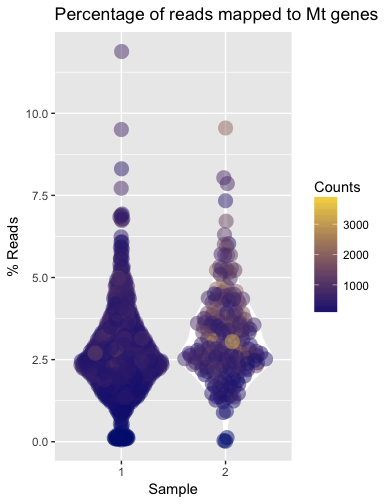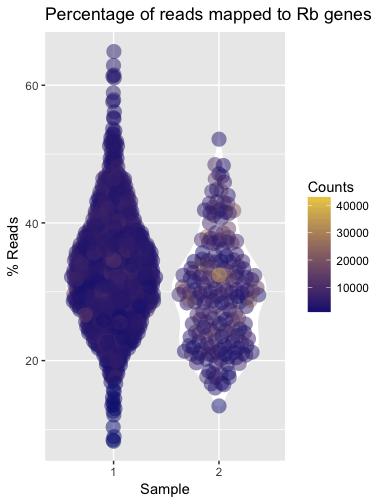

Review the control list by using `GetControls`. As you can see, we have stored the mitochondrial genes under "Mt" and ribosomal genes under "Rb."


```r
print(GetControls(em.set))
```

```
## $Mt
##  [1] "MT-ND1"  "MT-ND2"  "MT-CO1"  "MT-CO2"  "MT-ATP8" "MT-ATP6" "MT-CO3" 
##  [8] "MT-ND3"  "MT-ND4L" "MT-ND4"  "MT-ND5"  "MT-ND6"  "MT-CYB" 
## 
## $Rb
##   [1] "RPL22"          "RPL11"          "RPS6KA1"        "RPS8"          
##   [5] "RPL5"           "RPS27"          "RPS6KC1"        "RPS7"          
##   [9] "RPS27A"         "RPL31"          "RPL37A"         "RPL32"         
##  [13] "RPL15"          "RPSA"           "RPL14"          "RPL29"         
##  [17] "RPL24"          "RPL22L1"        "RPL39L"         "RPL35A"        
##  [21] "RPL9"           "RPL34-AS1"      "RPL34"          "RPS3A"         
##  [25] "RPL37"          "RPS23"          "RPS14"          "RPL26L1"       
##  [29] "RPS18"          "RPS10-NUDT3"    "RPS10"          "RPL10A"        
##  [33] "RPL7L1"         "RPS12"          "RPS6KA2"        "RPS6KA2-AS1"   
##  [37] "RPS6KA3"        "RPS4X"          "RPS6KA6"        "RPL36A"        
##  [41] "RPL36A-HNRNPH2" "RPL39"          "RPL10"          "RPS20"         
##  [45] "RPL7"           "RPL30"          "RPL8"           "RPS6"          
##  [49] "RPL35"          "RPL12"          "RPL7A"          "RPLP2"         
##  [53] "RPL27A"         "RPS13"          "RPS6KA4"        "RPS6KB2"       
##  [57] "RPS3"           "RPS25"          "RPS24"          "RPS26"         
##  [61] "RPL41"          "RPL6"           "RPLP0"          "RPL21"         
##  [65] "RPL10L"         "RPS29"          "RPL36AL"        "RPS6KL1"       
##  [69] "RPS6KA5"        "RPS27L"         "RPL4"           "RPLP1"         
##  [73] "RPS17"          "RPL3L"          "RPS2"           "RPS15A"        
##  [77] "RPL13"          "RPL26"          "RPL23A"         "RPL23"         
##  [81] "RPL19"          "RPL27"          "RPS6KB1"        "RPL38"         
##  [85] "RPL17-C18orf32" "RPL17"          "RPS21"          "RPS15"         
##  [89] "RPL36"          "RPS28"          "RPL18A"         "RPS16"         
##  [93] "RPS19"          "RPL18"          "RPL13A"         "RPS11"         
##  [97] "RPS9"           "RPL28"          "RPS5"           "RPS4Y1"        
## [101] "RPS4Y2"         "RPL3"           "RPS19BP1"
```

Use `FilterByCustomControl` to remove cells that are mostly expressing control genes. This function takes two arguments - the name of the list of control genes and the minimum percentage expression to filter by.


```r
# Filter by mitochondrial genes
em.set <- FilterByControl(control.name = "Mt", pct.threshold = 20, em.set)
```

```
## [1] "Calculating control metrics..."
## 
  |                                                                       
  |                                                                 |   0%
  |                                                                       
  |================================                                 |  50%
  |                                                                       
  |=================================================================| 100%
```

```r
# Filter by ribosomal genes
em.set <- FilterByControl(control.name = "Rb", pct.threshold = 50, em.set)
```

```
## [1] "Calculating control metrics..."
## 
  |                                                                       
  |                                                                 |   0%
  |                                                                       
  |================================                                 |  50%
  |                                                                       
  |=================================================================| 100%
```

Some analyses will require the removal of these controls. This should not be done at this stage; it is best done after normalisation.

#### Filtering by expression
The final step of filtering is to remove low-abundance genes. The average expression of genes can be reviewed on the average transcript count plots.


```r
print(raw.qc.plots$AverageGeneCount)
```

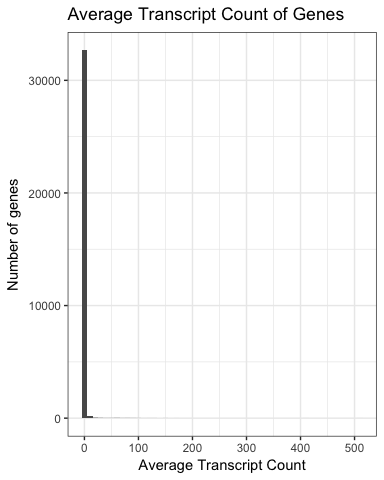

Due to the nature of single-cell RNASeq, many genes will have zero or near-zero expression. Have a closer look at the distribution with the Log2 and Log10 average transcript count plots. 


```r
print(raw.qc.plots$Log2AverageGeneCount)
print(raw.qc.plots$Log10AverageGeneCount)
```

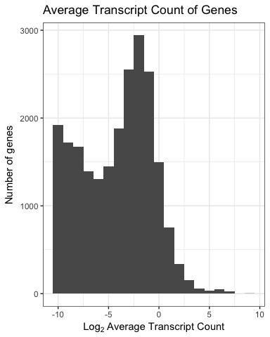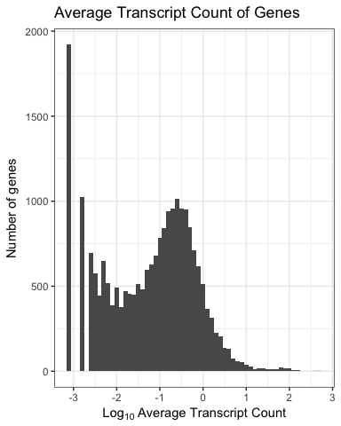

If we wanted to remove these genes, we can use `FilterByExpressedGenesPerCell`. This function removes genes that are expressed in at most, a certain percentage of the cell population.


```r
em.set <- FilterByExpressedGenesPerCell(em.set, pct.value = 1)
```

However, there are experiments where this is not ideal, such as this one. For example, we are interested in transcripts from the BRN3 family but these transcripts are expressed in only a small proportion of the cells. 


```r
expression.matrix <- GetExpressionMatrix(em.set, "data.frame")
brn3.transcripts <- c("POU4F1", "POU4F2", "POU4F3")
expression.matrix[brn3.transcripts, 
                  which(colSums(expression.matrix[brn3.transcripts,]) > 0)]
```

```
##        ACAGCCGTCTCGCTTG-1 ACGCCAGGTGGTGTAG-1 AGGGTGATCGCGTTTC-1
## POU4F1                  0                  0                  0
## POU4F2                  1                  2                  1
## POU4F3                  0                  0                  0
##        CAAGTTGTCACGCGGT-1 CACAGGCGTCGACTAT-1 CCAGCGATCAGCACAT-1
## POU4F1                  1                  0                  0
## POU4F2                  0                  3                  1
## POU4F3                  0                  0                  0
##        CGGGTCATCGCAAGCC-1 CGTAGCGCATCACCCT-1 CTACACCCAAAGGAAG-1
## POU4F1                  0                  0                  0
## POU4F2                  4                  1                  4
## POU4F3                  0                  0                  0
##        CTAGCCTGTGCAACGA-1 GAACGGAGTGGTCTCG-1 TAAGTGCGTAGCTTGT-1
## POU4F1                  0                  0                  0
## POU4F2                 10                  7                  5
## POU4F3                  0                  0                  0
##        TCGCGAGGTTCTCATT-1 TTTGCGCGTCTTTCAT-1 AAATGCCAGACAGACC-2
## POU4F1                  0                  0                  0
## POU4F2                  1                  2                  4
## POU4F3                  0                  0                  0
##        AACTTTCGTAGCGTCC-2 AGGCCGTTCACCCGAG-2 AGGGAGTGTTGGGACA-2
## POU4F1                  1                  0                  0
## POU4F2                  0                  1                  3
## POU4F3                  0                  0                  0
##        CGTCACTCATATGAGA-2 GGAAAGCAGGCCGAAT-2
## POU4F1                  0                  0
## POU4F2                  1                  5
## POU4F3                  0                  0
```

Other genes that are involved in the differentiation of the stem cells into retinal ganglion cells may also be lowly expressed, so we will omit this filtering step.

#### Filtering Review
The filtering functions record which barcodes were removed by the function and stores them in the `EMSet`. You can review the number of cells filtered by the functions by using the `DisplayLog` function.


```r
DisplayLog(em.set)
```

```
## $Controls
## [1] TRUE
## 
## $FilterByOutliers
## $FilterByOutliers$CellsFilteredByLibSize
## NULL
## 
## $FilterByOutliers$CellsFilteredByLowExpression
##  [1] "AACTGGTTCATAAAGG-1" "AAGACCTAGACAATAC-1" "ACAGCCGGTCTCTCTG-1"
##  [4] "ACGATACGTCACACGC-1" "ACTTGTTCAAGCGTAG-1" "AGCCTAACAGTAACGG-1"
##  [7] "AGTCTTTTCACCACCT-1" "AGTGTCAAGCCACTAT-1" "ATAACGCGTCGACTAT-1"
## [10] "ATCTACTCATTTGCTT-1" "ATTATCCTCCTTGACC-1" "CAGATCACAATAACGA-1"
## [13] "CCTCTGAAGATGTGGC-1" "CCTCTGATCGCATGAT-1" "CGCTATCGTGGCTCCA-1"
## [16] "CGTGTCTTCAATCACG-1" "CTCGTCATCAAACGGG-1" "CTTAACTCACCACGTG-1"
## [19] "GACCAATGTTCAACCA-1" "GACTAACGTTTGCATG-1" "GGCGTGTTCCAAGTAC-1"
## [22] "TAGACCAAGCTAACAA-1" "TAGCCGGCAGTCCTTC-1" "TCATTACAGGCAATTA-1"
## [25] "TGACTAGCATCACGTA-1" "ACTGAGTGTTAAGTAG-2"
## 
## $FilterByOutliers$CellsFilteredByControls
## $FilterByOutliers$CellsFilteredByControls$Mt
##  [1] "AACACGTAGTGGGTTG-1" "AACGTTGTCACGAAGG-1" "AAGACCTGTCTGGAGA-1"
##  [4] "ACGATGTTCCCATTTA-1" "ACGGCCACACCAGCAC-1" "ACTTTCATCCTAAGTG-1"
##  [7] "AGATCTGGTCGACTGC-1" "CACAGGCCATGTTGAC-1" "CATCGGGAGGCGCTCT-1"
## [10] "CTCTACGCAATCCGAT-1" "CTGAAACAGCACAGGT-1" "CTGATAGGTAAACGCG-1"
## [13] "GAAACTCGTTGGTAAA-1" "GAACCTAAGATATGGT-1" "GCACATATCTTCATGT-1"
## [16] "GGACAAGCAACTGCGC-1" "GGACAAGTCCTGCCAT-1" "GTATCTTTCACCAGGC-1"
## [19] "GTGAAGGTCTAACTTC-1" "GTTCTCGGTCGTTGTA-1" "TCATTTGGTCCGAACC-1"
## [22] "TGGCTGGCATAGAAAC-1" "TGTGGTAGTGCAGTAG-1" "AAAGTAGGTTAGTGGG-2"
## [25] "AAGGCAGAGCTAACAA-2" "ACTGAGTGTTAAGTAG-2" "AGCTCCTTCTCCAGGG-2"
## [28] "ATGTGTGAGTCAAGCG-2" "CGCGTTTAGGTGATAT-2" "CTGTGCTCAGCGTTCG-2"
## [31] "GACAGAGTCACAATGC-2" "GACGTTAGTACCCAAT-2" "GCGACCAGTTTGCATG-2"
## [34] "GTGAAGGGTGCTAGCC-2" "TGAGCCGCACAAGACG-2" "TGTGGTAAGTACGCGA-2"
## 
## $FilterByOutliers$CellsFilteredByControls$Rb
## [1] "AACTGGTTCATAAAGG-1" "ACGATACGTCACACGC-1" "AGCCTAACAGTAACGG-1"
## [4] "AGTCTTTTCACCACCT-1" "ATAACGCGTCGACTAT-1" "ATCTACTCATTTGCTT-1"
## [7] "ATTATCCTCCTTGACC-1" "CTTAACTCACCACGTG-1" "TCATTACAGGCAATTA-1"
## 
## 
## 
## $FilteringLog
##   CellsFilteredByLibSize CellsFilteredByExpression CellsFilteredByControls
## 1                      0                        26                      45
##   CellsFilteredByMt CellsFilteredByRb
## 1                 0                11
## 
## $FilterByControl
## $FilterByControl$Mt
## list()
## 
## $FilterByControl$Rb
##  [1] "ACCAGTATCGGTTCGG-1" "CAGCGACAGCAGCGTA-1" "CGAATGTAGGCTCTTA-1"
##  [4] "CTTCTCTAGCACGCCT-1" "GGGAGATGTAAAGGAG-1" "GTATTCTAGTCCATAC-1"
##  [7] "TCGCGTTAGCAGGTCA-1" "TGCCCTAGTCCAGTTA-1" "TGGCTGGTCGAATCCA-1"
## [10] "TTAGTTCAGTTACGGG-1" "TTCGGTCAGGATGGAA-1"
```

You can also run `PlotGeneralQC` again to see how the filtering has altered the dataset.


### Normalisation
Normalisation needs to be done at two levels - between batches and between cells.

The ascend package contains the following normalisation functions:

* NormaliseBatches: Normalise library sizes between batches.
* NormaliseByRLE: Normalise library sizes between cells by Relative Log Expression (RLE).
* scranNormalise: Normalise library sizes between cells using *scran*'s deconvolution method.

How you use these functions depends on the dataset.

#### NormaliseBatches
Normalisation between batches needs to be done prior to filtering.

For this tutorial - we do not need to use the `NormaliseBatches` as this dataset was prepared with Cell Ranger's *aggr* pipeline. This pipeline uses a subsampling process to normalise between batches [(Zheng et al. 2017)][3].

We do need to normalise between cells so we can use one of the following functions: `NormaliseByRLE` or `scranNormalise`.

#### NormaliseByRLE
In this method, each cell is considered as one library and assumes that most genes are not differentially expressed. It uses gene expression values higher than 0 to calculate the geometric means of a gene. The geometric mean is the mean of the expression of the gene across all cells (for cells where the gene is detected). Each gene has one geometric mean value for all cell. For each cell, the gene expression values are divided by the geometric means to get one normalisation factor for a gene in that cell. The median of all the normalisation factors for all genes in that cell is the normalisation factor for the cell. Post RLE normalisation, a gene with 0 expression still has 0 expression. A gene with expression higher than 0 will have an expression value equal the raw expression divided by the calculated normalization factor for the cell. As spike-ins affect library size, they need to be removed prior to normalisation.

This method is relatively quick and can be run on a desktop.


```r
norm.set <- NormaliseByRLE(em.set)
```

#### scranNormalise
This function is a wrapper for the deconvolution method by [Lun et al. 2015][4] that uses the [scran][2] and [scater][4] packages. This method takes into account the high proportion of zero counts in single-cell data and tackles the zero-inflation problem by applying a pooling strategy to calculate size-factors of each pool. The pooled size factors are then deconvoluted to infer the size factor for each cell, which are used scale the counts within that cell. The [scran vignette][5] explains the whole process in greater detail.

To ensure compatibility with `scran` and `scater`, the `EMSet` needs to have mitochondrial and ribosomal genes as controls. The control list also needs to be formatted as follows:


```r
print(GetControls(em.set))
```

```
## $Mt
##  [1] "MT-ND1"  "MT-ND2"  "MT-CO1"  "MT-CO2"  "MT-ATP8" "MT-ATP6" "MT-CO3" 
##  [8] "MT-ND3"  "MT-ND4L" "MT-ND4"  "MT-ND5"  "MT-ND6"  "MT-CYB" 
## 
## $Rb
##   [1] "RPL22"          "RPL11"          "RPS6KA1"        "RPS8"          
##   [5] "RPL5"           "RPS27"          "RPS6KC1"        "RPS7"          
##   [9] "RPS27A"         "RPL31"          "RPL37A"         "RPL32"         
##  [13] "RPL15"          "RPSA"           "RPL14"          "RPL29"         
##  [17] "RPL24"          "RPL22L1"        "RPL39L"         "RPL35A"        
##  [21] "RPL9"           "RPL34-AS1"      "RPL34"          "RPS3A"         
##  [25] "RPL37"          "RPS23"          "RPS14"          "RPL26L1"       
##  [29] "RPS18"          "RPS10-NUDT3"    "RPS10"          "RPL10A"        
##  [33] "RPL7L1"         "RPS12"          "RPS6KA2"        "RPS6KA2-AS1"   
##  [37] "RPS6KA3"        "RPS4X"          "RPS6KA6"        "RPL36A"        
##  [41] "RPL36A-HNRNPH2" "RPL39"          "RPL10"          "RPS20"         
##  [45] "RPL7"           "RPL30"          "RPL8"           "RPS6"          
##  [49] "RPL35"          "RPL12"          "RPL7A"          "RPLP2"         
##  [53] "RPL27A"         "RPS13"          "RPS6KA4"        "RPS6KB2"       
##  [57] "RPS3"           "RPS25"          "RPS24"          "RPS26"         
##  [61] "RPL41"          "RPL6"           "RPLP0"          "RPL21"         
##  [65] "RPL10L"         "RPS29"          "RPL36AL"        "RPS6KL1"       
##  [69] "RPS6KA5"        "RPS27L"         "RPL4"           "RPLP1"         
##  [73] "RPS17"          "RPL3L"          "RPS2"           "RPS15A"        
##  [77] "RPL13"          "RPL26"          "RPL23A"         "RPL23"         
##  [81] "RPL19"          "RPL27"          "RPS6KB1"        "RPL38"         
##  [85] "RPL17-C18orf32" "RPL17"          "RPS21"          "RPS15"         
##  [89] "RPL36"          "RPS28"          "RPL18A"         "RPS16"         
##  [93] "RPS19"          "RPL18"          "RPL13A"         "RPS11"         
##  [97] "RPS9"           "RPL28"          "RPS5"           "RPS4Y1"        
## [101] "RPS4Y2"         "RPL3"           "RPS19BP1"
```

If the dataset contains less than 10,000 cells, `scranNormalise` will run `scran`'s `computeSumFactors` function with preset sizes of 40, 60, 80 and 100. For larger datasets, `scranNormalise` will run `quickCluster` before `computeSumFactors`. `scran` 1.6.6 introduced an additional argument - *min.mean* to the function `computeSumFactors`. This is the threshold for average counts. By default, it is set by `ascend` to 1e-5 as this value works best for UMI data. If you are working with read counts, please set this value to 1.

This method is computationally intensive; we do not recommend running datasets larger than 5000 cells on a desktop machine. Datasets larger than 10,000 cells should be run on a HPC.


```r
norm.set <- scranNormalise(em.set, quickCluster = FALSE, min.mean = 1e-5)
```

```
## [1] "Converting EMSet to SingleCellExperiment..."
## [1] "1200 cells detected. Running computeSumFactors with preset sizes of 40, 60, 80, 100..."
## [1] "scran's computeSumFactors complete. Removing zero sum factors from dataset..."
## [1] "Running scater's normalize method..."
## [1] "Normalisation complete. Converting SingleCellExperiment back to EMSet..."
## [1] "Calculating control metrics..."
## 
  |                                                                       
  |                                                                 |   0%
  |                                                                       
  |================================                                 |  50%
  |                                                                       
  |=================================================================| 100%
```

#### Reviewing the normalisation process
`PlotNormalisationQC` will generate a series of plots for the review of the normalisation process. This function can only be used if you have retained the un-normalised `EMSet`. You can also review the expression of genes you are interested in; in this case, we will look at the expression of GAPDH and MALAT1 as they are considered 'housekeeping' genes.


```r
norm.qc <- PlotNormalisationQC(original = em.set, normalised = norm.set, 
                               gene.list = c("GAPDH", "MALAT1"))
```

```
## [1] "Retrieving data from EMSets..."
## [1] "Plotting libsize histograms..."
## [1] "Plotting GAPDH expression..."
## [1] "Plotting MALAT1 expression..."
## [1] "Plotting gene expression box plots..."
## [1] "Plotting gene expression box plots..."
## [1] "Plots complete!"
```

The first set of graphs are library size histograms. The `scranNormalise` affects library size to a greater extent than the `NormaliseByRLE`.


```r
print(norm.qc$Libsize$Original)
print(norm.qc$Libsize$Normalised)
```

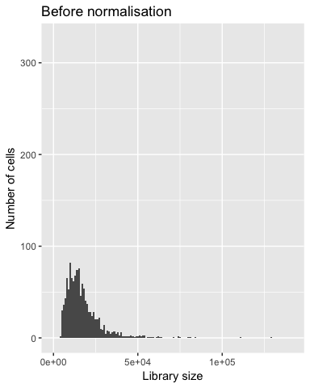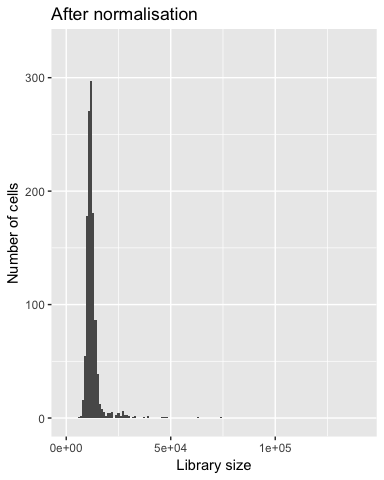

The gene scatter plots show how expression has changed on a gene level. Both genes are strongly expressed in this dataset, and normalisation has enabled us to make a clearer distinction between the expression level of these genes between each cell.


```r
print(norm.qc$GeneScatterPlots$GAPDH$Original)
print(norm.qc$GeneScatterPlots$GAPDH$Normalised)
print(norm.qc$GeneScatterPlots$MALAT1$Original)
print(norm.qc$GeneScatterPlots$MALAT1$Normalised)
```

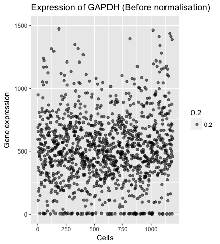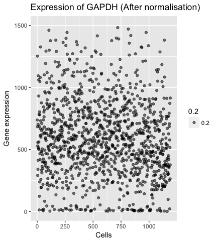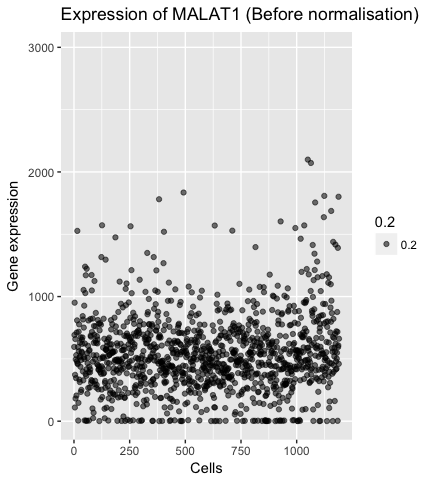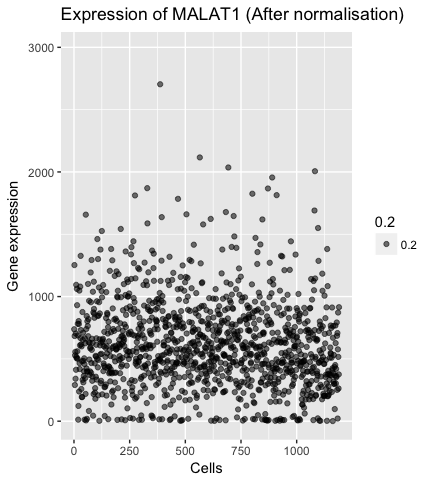

The changes to overall gene expression can also be reviewed on gene expression boxplots.


```r
print(norm.qc$GeneExpressionBoxplot$Original)
print(norm.qc$GeneExpressionBoxplot$Normalised)
```

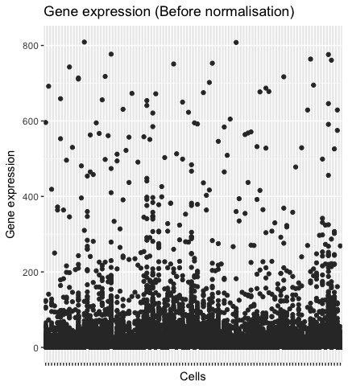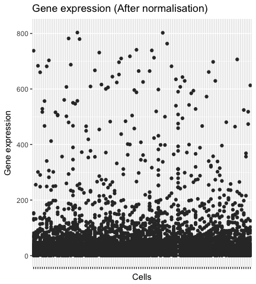

### Control Removal
We can review the genes that dominate expression with the `PlotTopGeneExpression` function. This function gets called by the `PlotGeneralQC` function as well.

Let's review the plot generated by the `PlotGeneralQC` function after filtering.

```r
print(filtered.qc.plots$TopGenes)
```

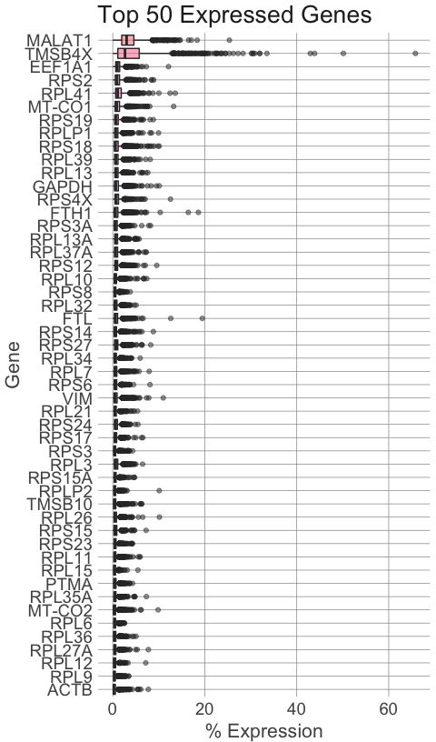<!-- -->

As you can see, ribosomal genes dominate gene expression, even after filtering. What does the dataset look like without these control genes? We will just plot the top 20 most expressed genes.


```r
top.20.plot <- PlotTopGeneExpression(norm.set, n = 20, controls = FALSE)
```

```
## [1] "Calculating control metrics..."
```

```r
print(top.20.plot)
```

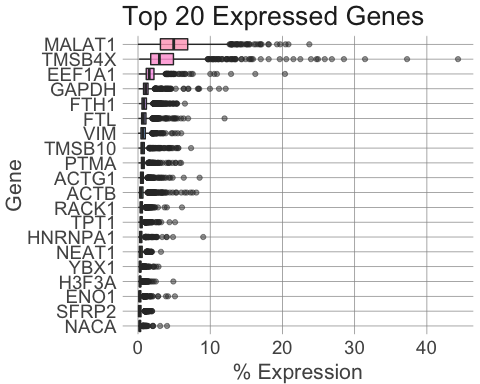

As we are interested in the expression of non-control genes, we will need to remove the controls from the dataset. This can be done with the `ExcludeControl` function.


```r
norm.set <- ExcludeControl(norm.set, "Mt")
norm.set <- ExcludeControl(norm.set, "Rb")
```

Please note that this has already been done as a part of the `scranNormalise` process.

### Regression of Counfounding Factors
If we suspect there are transcripts that would bias the data and are not relevent to our analysis, we can regress them out with the `RegressConfoundingFactors` function.


```r
cell.cycle.genes <- c("CDK4","CCND1","NOC2L","ATAD3C", "CCNL2")
em.set <- RegressConfoundingFactors(em.set, candidate.genes = cell.cycle.genes)
```


### Dimension Reduction
We have filtered our dataset down to 1235 cells and 32904 genes and normalised the transcript counts with `scranNormalise`. We can reduce this dataset further by using *Principal Component Analysis (PCA)* to identify genes that are major contributors to variation.


```r
pca.set <- RunPCA(norm.set)
```

```
## [1] "Retrieving data..."
## [1] "Calculating variance..."
## [1] "Computing PCA values..."
## [1] "PCA complete! Returning object..."
```

PlotPCAVariance` generates what is known as a *scree plot*, which depicts what percentage each PC contributes to the total variance of the data. This will help determine how many PCs the dataset should be reduced to.


```r
pca.variance <- PlotPCAVariance(pca.set, n = 50)
print(pca.variance)
```

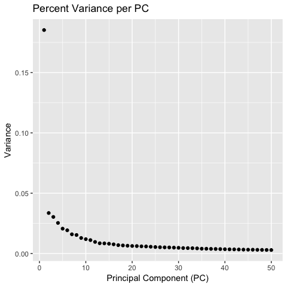

The scree plot shows most of the variance is due to the top 20 PCs. Reduce the dataset to 20 PCs with the `ReduceDimensions` function.


```r
pca.set <- ReduceDimensions(pca.set, n = 20)
```

### Clustering
Clustering can be done on the original expression matrix or the PCA-transformed matrix, which is the preferred input. Use `RunCORE` to identify clusters. You can use the following arguments to finetune the algorithm. 


Argument         Description                                                                                                                            
---------------  ---------------------------------------------------------------------------------------------------------------------------------------
conservative     Use conservative (more stable) clustering result (TRUE or FALSE). Default: TRUE                                                        
windows          Range to perform cuts on the dendrogram Default: seq(0.025:1, by=0.025).                                                               
remove_outlier   Remove cells that weren't assigned a cluster with dynamicTreeCut. This is indicative of outlier cells within the sample. Default: TRUE 

This function has only one argumenmt - `conservative`. This argument is only used when the algorithm detects more than one set of stable results. If set to TRUE, the function will choose the result that is the most stable but yields the least number of clusters. If set to FALSE, the function will choose the result that is the least stable, but yields the most number of clusters.


```r
clustered.set <- RunCORE(pca.set, 
                         conservative = TRUE, 
                         windows = seq(0.025:1, by = 0.025), 
                         remove_outlier = FALSE )
```

```
## [1] "Performing unsupervised clustering..."
## [1] "Generating clusters by running dynamicTreeCut at different heights..."
## 
  |                                                                       
  |                                                                 |   0%
  |                                                                       
  |======================                                           |  33%
  |                                                                       
  |===========================================                      |  67%
  |                                                                       
  |=================================================================| 100%
## 
## [1] "Calculating rand indices..."
## [1] "Calculating stability values..."
## [1] "Aggregating data..."
## 
  |                                                                       
  |                                                                 |   0%
  |                                                                       
  |======================                                           |  33%
  |                                                                       
  |===========================================                      |  67%
  |                                                                       
  |=================================================================| 100%
## 
## [1] "Finding optimal number of clusters..."
## [1] "Optimal number of clusters found! Returning output..."
```

The `RunCORE` function generates a distance matrix based on the input and from this, builds a dendrogram. This dendrogram is then cut with the `DynamicTreeCut` algorithm to select clusters from the dendrogram based on the shape and size of the branches. This is repeated again, but this time with the tree-height parameter set to 40 values ranging from 0.025 (the bottom of the tree) to 1 (the top of the tree). 

The `PlotStabilityDendro` generates a plot that represents this part of the process. In addition to the dendrogram, it generates the distribution of clusters across the 40 cut heights.


```r
PlotStabilityDendro(clustered.set)
```

```
## $mar
## [1] 1 5 0 1
```

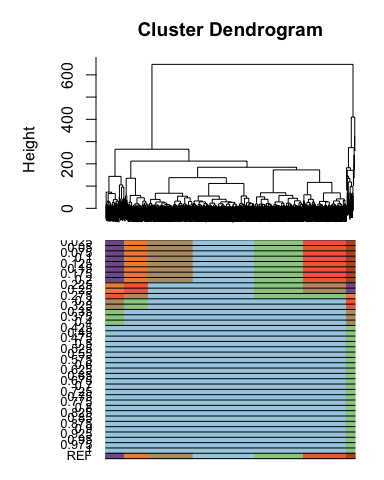

The clustering results are then compared quantitatively using rand indices, which calculates every pair of cells being in the same cluster or not. It is used as an indicator of the stability of a clustering result. If a rand index is stable across multiple tree-height values, this indicates the tree-height produces the most stable clustering result.  

This information is shown on a plot generated by the `PlotStability` function.


```r
PlotStability(clustered.set)
```

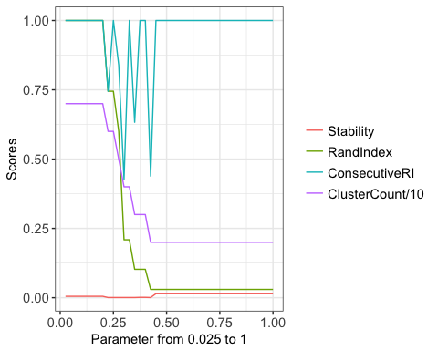

The rand index is stable in more than 50% of tree-cut heights that correspond to the lowest number of clusters. This indicates that 2 clusters is the most stable cluster assignment.

You can review this information in tabular form by using `GetRandMatrix`.


```r
rand.matrix <- GetRandMatrix(clustered.set)
rand.matrix
```

```
##    Height Stability  RandIndex ConsecutiveRI ClusterCount
## 1   0.025     0.200 1.00000000     1.0000000            7
## 2    0.05     0.200 1.00000000     1.0000000            7
## 3   0.075     0.200 1.00000000     1.0000000            7
## 4     0.1     0.200 1.00000000     1.0000000            7
## 5   0.125     0.200 1.00000000     1.0000000            7
## 6    0.15     0.200 1.00000000     1.0000000            7
## 7   0.175     0.200 1.00000000     1.0000000            7
## 8     0.2     0.200 1.00000000     1.0000000            7
## 9   0.225     0.025 0.74484782     0.7448478            6
## 10   0.25     0.025 0.74484782     1.0000000            6
## 11  0.275     0.025 0.60083697     0.8396588            5
## 12    0.3     0.025 0.20897468     0.4273129            4
## 13  0.325     0.025 0.20897468     1.0000000            4
## 14   0.35     0.025 0.10248122     0.6328317            3
## 15  0.375     0.050 0.10248122     1.0000000            3
## 16    0.4     0.050 0.10248122     1.0000000            3
## 17  0.425     0.025 0.02988621     0.4385739            2
## 18   0.45     0.575 0.02988621     1.0000000            2
## 19  0.475     0.575 0.02988621     1.0000000            2
## 20    0.5     0.575 0.02988621     1.0000000            2
## 21  0.525     0.575 0.02988621     1.0000000            2
## 22   0.55     0.575 0.02988621     1.0000000            2
## 23  0.575     0.575 0.02988621     1.0000000            2
## 24    0.6     0.575 0.02988621     1.0000000            2
## 25  0.625     0.575 0.02988621     1.0000000            2
## 26   0.65     0.575 0.02988621     1.0000000            2
## 27  0.675     0.575 0.02988621     1.0000000            2
## 28    0.7     0.575 0.02988621     1.0000000            2
## 29  0.725     0.575 0.02988621     1.0000000            2
## 30   0.75     0.575 0.02988621     1.0000000            2
## 31  0.775     0.575 0.02988621     1.0000000            2
## 32    0.8     0.575 0.02988621     1.0000000            2
## 33  0.825     0.575 0.02988621     1.0000000            2
## 34   0.85     0.575 0.02988621     1.0000000            2
## 35  0.875     0.575 0.02988621     1.0000000            2
## 36    0.9     0.575 0.02988621     1.0000000            2
## 37  0.925     0.575 0.02988621     1.0000000            2
## 38   0.95     0.575 0.02988621     1.0000000            2
## 39  0.975     0.575 0.02988621     1.0000000            2
## 40      1     0.575 0.02988621     1.0000000            2
```

The `PlotDendrogram` function generates a dendrogram that depicts each cluster and its members.


```r
PlotDendrogram(clustered.set)
```

```
## Warning in `labels<-.dendrogram`(dend, value = value, ...): The lengths
## of the new labels is shorter than the number of leaves in the dendrogram -
## labels are recycled.
```

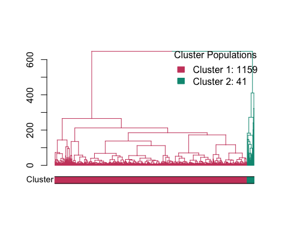

The cluster information has been added as a new column in the Cell Information slot, which can be retrieved with the `GetCellInfo` function.


```r
cell.info <- GetCellInfo(clustered.set)
cell.info[1:5,]
```

```
##         cell_barcode batch THY1  BRN3 phase cluster
## 1 AAACCTGAGCTGTTCA-1     1 TRUE FALSE    G1       1
## 2 AAACCTGCAATTCCTT-1     1 TRUE FALSE     S       1
## 3 AAACCTGGTCTACCTC-1     1 TRUE FALSE     S       1
## 4 AAACCTGTCGGAGCAA-1     1 TRUE FALSE    G1       1
## 5 AAACGGGAGTCGATAA-1     1 TRUE FALSE    G1       1
```

### Differential Expression
This package uses `DESeq` to perform differential expression, and can be done with or without clustering. Each cell needs to be assigned one of two conditions; for this tutorial, we will use batch information and clustering information. This step is computationally intensive for larger datasets.

The `RunDiffExpression` calls `DESeq` to perform differential expression between two conditions. This function can be run with or without clustering, after PCA reduction. If this function is unable to fit your data, you may adjust the arguments `method` and `fitType`. These arguments are for `DESeq`'s `estimateDispersions` function.
 
First, let's compare the expression of THY1-positive cells to THY1-negative cells.


```r
thy1.de.result <- RunDiffExpression(clustered.set, 
                                    condition.a = "TRUE", 
                                    condition.b = "FALSE", 
                                    conditions = "THY1", 
                                    fitType = "local", 
                                    method = "per-condition")
```

```
## [1] "Rounding expression matrix values..."
## [1] "Chunking matrix..."
## [1] "Chunking expression matrix by rows..."
```

```
## Warning in split.default(sample(1:nelements), 1:chunks): data length is not
## a multiple of split variable
```

```
## [1] "Running DESeq..."
## 
  |                                                                       
  |                                                                 |   0%
  |                                                                       
  |======================                                           |  33%
  |                                                                       
  |===========================================                      |  67%
  |                                                                       
  |=================================================================| 100%
## 
## [1] "Differential expression complete!"
## [1] "Combining DE results..."
## [1] "Adjusting fold change values..."
```

```r
thy1.de.result[1:10,]
```

```
##              id  baseMean baseMeanA baseMeanB foldChange log2FoldChange
## 8572        MGP  1.909382  1.041005  6.830186 142.182641       7.151602
## 9197     COL3A1  1.569831  1.082235  4.332875  40.528617       5.340869
## 9716     LGALS1  4.961239  3.026392 15.925373   7.365490       2.880782
## 18062      CTGF  2.737184  1.638402  8.963615  12.474295       3.640886
## 5654       TGM2  1.755788  1.379821  3.886269   7.599029       2.925815
## 18429     ITGB1  4.579503  3.893725  8.465577   2.579919       1.367326
## 11478      TPM1 10.780457  7.822569 27.541825   3.890298       1.959881
## 20941    COL1A1  3.977642  2.902676 10.069116   4.766505       2.252932
## 12769 TNFRSF12A  2.124411  1.761467  4.181094   4.177587       2.062670
## 7095      FSTL1  2.568801  2.247936  4.387037   2.714111       1.440480
##                pval         padj
## 8572  8.649951e-102 8.693201e-99
## 9197   5.398602e-47 5.425595e-44
## 9716   8.760503e-36 4.402153e-33
## 18062  2.215788e-35 2.226867e-32
## 5654   2.298909e-26 2.310404e-23
## 18429  1.205198e-23 1.211224e-20
## 11478  3.965197e-23 3.985023e-20
## 20941  4.004524e-23 4.020542e-20
## 12769  1.191989e-21 1.197949e-18
## 7095   9.793004e-21 9.841969e-18
```

The results are sorted in ascending order, based on the p-value. The fold change values have been adjusted; they represent absolute fold change.

We can view these results as a volcano plot with the `PlotDEVolcano` function.


```r
thy1.volcano.plot <- PlotDEVolcano(thy1.de.result, labels = FALSE)
print(thy1.volcano.plot)
```

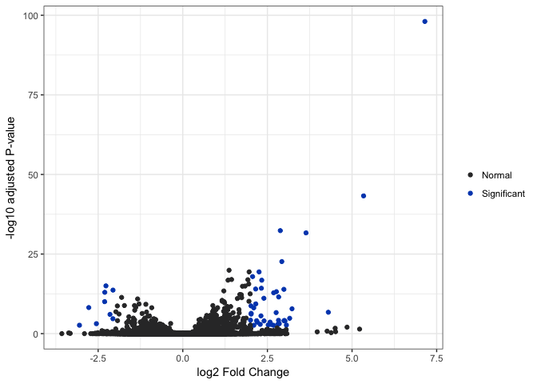<!-- -->

Let's examine what genes are differentially expressed between clusters 1 and 2.


```r
cluster.de.result <- RunDiffExpression(clustered.set,
                                       condition.a = "1",
                                       condition.b = "2",
                                       condition = "cluster", 
                                       fitType = "local", 
                                       method = "per-condition")
```

```
## [1] "Rounding expression matrix values..."
## [1] "Chunking matrix..."
## [1] "Chunking expression matrix by rows..."
```

```
## Warning in split.default(sample(1:nelements), 1:chunks): data length is not
## a multiple of split variable
```

```
## [1] "Running DESeq..."
## 
  |                                                                       
  |                                                                 |   0%
  |                                                                       
  |======================                                           |  33%
  |                                                                       
  |===========================================                      |  67%
  |                                                                       
  |=================================================================| 100%
## 
## [1] "Differential expression complete!"
## [1] "Combining DE results..."
## [1] "Adjusting fold change values..."
```

```r
cluster.de.result[1:10,]
```

```
##           id  baseMean baseMeanA baseMeanB foldChange log2FoldChange
## 3846   GAPDH 144.30978 130.57070  532.6899   4.103473       2.036846
## 9133    ACTB  74.86048  64.74654  360.7643   5.643667       2.496633
## 17423 TMSB4X 463.69241 419.99849 1698.8450   4.052151       2.018688
## 15095 EEF1A1 217.05309 200.77973  677.0732   3.384093       1.758769
## 14209   TUBB  27.78286  24.45483  121.8608   5.152920       2.365390
## 11534   PTMA  89.68058  81.77276  313.2212   3.865426       1.950628
## 17620    FTL 112.39948 103.44511  365.5241   3.558238       1.831163
## 14450  UBA52  31.22295  28.12513  118.7928   4.342570       2.118549
## 16914  GSTP1  33.97236  30.30304  137.6977   4.664968       2.221867
## 15951   TPI1  32.51464  29.19327  126.4042   4.448019       2.153163
##               pval         padj
## 3846  1.454009e-90 1.461279e-87
## 9133  2.758893e-83 2.772687e-80
## 17423 4.229713e-69 4.250861e-66
## 15095 4.575169e-61 4.598045e-58
## 14209 8.575240e-58 8.618116e-55
## 11534 6.274023e-56 6.305393e-53
## 17620 2.203635e-55 1.107326e-52
## 14450 8.252586e-55 4.146924e-52
## 16914 9.329991e-55 9.376641e-52
## 15951 1.014393e-53 5.097327e-51
```

These results underwent further analysis, and revealed cells in cluster 2 were strongly expressing apoptopic genes. The cells in this cluster were deemed 'low quality' and removed from the dataset. To confirm that the remaining cells were good quality, the dataset re-clustered.


```r
clean.set <- SubsetCluster(clustered.set, clusters = "1")
```

```
## [1] "Calculating control metrics..."
## 
  |                                                                       
  |                                                                 |   0%
  |                                                                       
  |================================                                 |  50%
  |                                                                       
  |=================================================================| 100%
```

```r
clean.pca <- RunPCA(clean.set)
```

```
## [1] "Retrieving data..."
## [1] "Calculating variance..."
## [1] "Computing PCA values..."
## [1] "PCA complete! Returning object..."
```

```r
clean.cluster <- RunCORE(clean.pca, conservative = TRUE)
```

```
## [1] "Performing unsupervised clustering..."
## [1] "Generating clusters by running dynamicTreeCut at different heights..."
## 
  |                                                                       
  |                                                                 |   0%
  |                                                                       
  |======================                                           |  33%
  |                                                                       
  |===========================================                      |  67%
  |                                                                       
  |=================================================================| 100%
## 
## [1] "Calculating rand indices..."
## [1] "Calculating stability values..."
## [1] "Aggregating data..."
## 
  |                                                                       
  |                                                                 |   0%
  |                                                                       
  |======================                                           |  33%
  |                                                                       
  |===========================================                      |  67%
  |                                                                       
  |=================================================================| 100%
## 
## [1] "Finding optimal number of clusters..."
## [1] "Optimal number of clusters found! Returning output..."
```

```r
PlotDendrogram(clean.cluster)
```

```
## Warning in `labels<-.dendrogram`(dend, value = value, ...): The lengths
## of the new labels is shorter than the number of leaves in the dendrogram -
## labels are recycled.
```

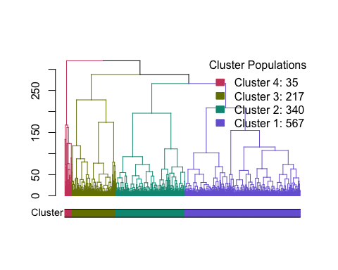<!-- -->

Reclustering and differential expression revealed the remaining 1159 cells comprised of four subpopulations, each representing retinal ganglion cells at different stages of differentiation.

#### Comparing each cluster against all other clusters
The `RunDiffExpression` can be called to run multiple comparisons at once, using standard R functions such as `lapply` and `sapply`. The use of "Others" as condition.b tells the function to compare cells that have condition.a to all other cells that don't. If you need to do a lot of comparisons, you can even use BiocParallel's `bplapply` to run this function.


```r
# List of clusters to compare
cluster.list <- c("1", "2", "3", "4")

# Create a custom function to call RunDiffExpession
customFunction <- function(x, clean.cluster){
  # This is a standard RunDiffExpression call; The only difference is "x" will
  # be inputted by the sapply function
  de.result <- RunDiffExpression(clean.cluster, 
                                 condition.a = x, 
                                 condition.b = "Others",
                                 conditions = "cluster")
  # This will output the differential expression result as a list of dataframes
  return (de.result)
}

clean.cluster.de.results <- lapply(cluster.list, function(x)
  customFunction(x, clean.cluster))
```

```
## [1] "Rounding expression matrix values..."
## [1] "Chunking matrix..."
## [1] "Chunking expression matrix by rows..."
```

```
## Warning in split.default(sample(1:nelements), 1:chunks): data length is not
## a multiple of split variable
```

```
## [1] "Running DESeq..."
## 
  |                                                                       
  |                                                                 |   0%
  |                                                                       
  |======================                                           |  33%
  |                                                                       
  |===========================================                      |  67%
  |                                                                       
  |=================================================================| 100%
## 
## [1] "Differential expression complete!"
## [1] "Combining DE results..."
## [1] "Adjusting fold change values..."
## [1] "Rounding expression matrix values..."
## [1] "Chunking matrix..."
## [1] "Chunking expression matrix by rows..."
```

```
## Warning in split.default(sample(1:nelements), 1:chunks): data length is not
## a multiple of split variable
```

```
## [1] "Running DESeq..."
## 
  |                                                                       
  |                                                                 |   0%
  |                                                                       
  |======================                                           |  33%
  |                                                                       
  |===========================================                      |  67%
  |                                                                       
  |=================================================================| 100%
## 
## [1] "Differential expression complete!"
## [1] "Combining DE results..."
## [1] "Adjusting fold change values..."
## [1] "Rounding expression matrix values..."
## [1] "Chunking matrix..."
## [1] "Chunking expression matrix by rows..."
```

```
## Warning in split.default(sample(1:nelements), 1:chunks): data length is not
## a multiple of split variable
```

```
## [1] "Running DESeq..."
## 
  |                                                                       
  |                                                                 |   0%
  |                                                                       
  |======================                                           |  33%
  |                                                                       
  |===========================================                      |  67%
  |                                                                       
  |=================================================================| 100%
## 
## [1] "Differential expression complete!"
## [1] "Combining DE results..."
## [1] "Adjusting fold change values..."
## [1] "Rounding expression matrix values..."
## [1] "Chunking matrix..."
## [1] "Chunking expression matrix by rows..."
```

```
## Warning in split.default(sample(1:nelements), 1:chunks): data length is not
## a multiple of split variable
```

```
## [1] "Running DESeq..."
## 
  |                                                                       
  |                                                                 |   0%
  |                                                                       
  |======================                                           |  33%
  |                                                                       
  |===========================================                      |  67%
  |                                                                       
  |=================================================================| 100%
## 
## [1] "Differential expression complete!"
## [1] "Combining DE results..."
## [1] "Adjusting fold change values..."
```

```r
# Generate volcano plots
cluster.de.1 <- PlotDEVolcano(clean.cluster.de.results[[1]], labels = FALSE)
cluster.de.2 <- PlotDEVolcano(clean.cluster.de.results[[2]], labels = FALSE)
cluster.de.3 <- PlotDEVolcano(clean.cluster.de.results[[3]], labels = FALSE)
cluster.de.4 <- PlotDEVolcano(clean.cluster.de.results[[4]], labels = FALSE)
print(cluster.de.1)
```

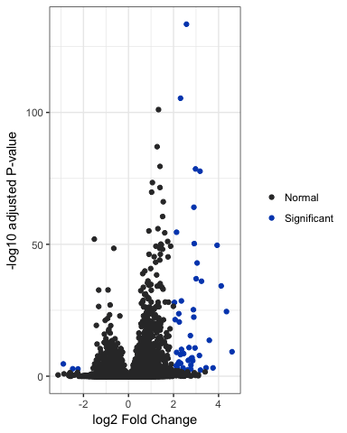<!-- -->

```r
print(cluster.de.2)
```

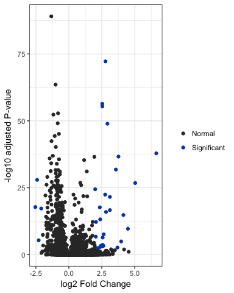<!-- -->

```r
print(cluster.de.3)
```

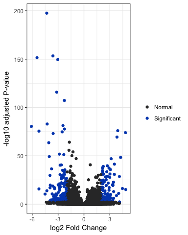<!-- -->

```r
print(cluster.de.4)
```

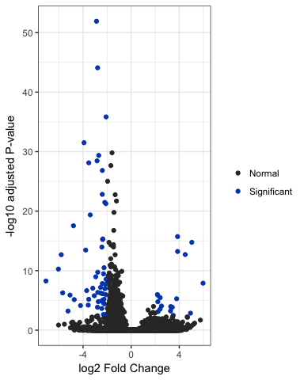<!-- -->

#### Comparing pairs of clusters
We can also compare pairs of clusters by setting conditions A and B in the `RunDiffExpression` function.

```r
# Run differential expression on pairs
c1c2.de.results <- RunDiffExpression(clean.cluster, condition.a = "1", 
                                     condition.b = "2", conditions = "cluster")
```

```
## [1] "Rounding expression matrix values..."
## [1] "Chunking matrix..."
## [1] "Chunking expression matrix by rows..."
```

```
## Warning in split.default(sample(1:nelements), 1:chunks): data length is not
## a multiple of split variable
```

```
## [1] "Running DESeq..."
## 
  |                                                                       
  |                                                                 |   0%
  |                                                                       
  |======================                                           |  33%
  |                                                                       
  |===========================================                      |  67%
  |                                                                       
  |=================================================================| 100%
## 
## [1] "Differential expression complete!"
## [1] "Combining DE results..."
## [1] "Adjusting fold change values..."
```

```r
c1c3.de.results <- RunDiffExpression(clean.cluster, condition.a = "1", 
                                     condition.b = "3", conditions = "cluster")
```

```
## [1] "Rounding expression matrix values..."
## [1] "Chunking matrix..."
## [1] "Chunking expression matrix by rows..."
```

```
## Warning in split.default(sample(1:nelements), 1:chunks): data length is not
## a multiple of split variable
```

```
## [1] "Running DESeq..."
## 
  |                                                                       
  |                                                                 |   0%
  |                                                                       
  |======================                                           |  33%
  |                                                                       
  |===========================================                      |  67%
  |                                                                       
  |=================================================================| 100%
## 
## [1] "Differential expression complete!"
## [1] "Combining DE results..."
## [1] "Adjusting fold change values..."
```

```r
c1c4.de.results <- RunDiffExpression(clean.cluster, condition.a = "1", 
                                     condition.b = "4", conditions = "cluster")
```

```
## [1] "Rounding expression matrix values..."
## [1] "Chunking matrix..."
## [1] "Chunking expression matrix by rows..."
```

```
## Warning in split.default(sample(1:nelements), 1:chunks): data length is not
## a multiple of split variable
```

```
## [1] "Running DESeq..."
## 
  |                                                                       
  |                                                                 |   0%
  |                                                                       
  |======================                                           |  33%
  |                                                                       
  |===========================================                      |  67%
  |                                                                       
  |=================================================================| 100%
## 
## [1] "Differential expression complete!"
## [1] "Combining DE results..."
## [1] "Adjusting fold change values..."
```

```r
c2c3.de.results <- RunDiffExpression(clean.cluster, condition.a = "2", 
                                     condition.b = "3", conditions = "cluster")
```

```
## [1] "Rounding expression matrix values..."
## [1] "Chunking matrix..."
## [1] "Chunking expression matrix by rows..."
```

```
## Warning in split.default(sample(1:nelements), 1:chunks): data length is not
## a multiple of split variable
```

```
## [1] "Running DESeq..."
## 
  |                                                                       
  |                                                                 |   0%
  |                                                                       
  |======================                                           |  33%
  |                                                                       
  |===========================================                      |  67%
  |                                                                       
  |=================================================================| 100%
## 
## [1] "Differential expression complete!"
## [1] "Combining DE results..."
## [1] "Adjusting fold change values..."
```

```r
c2c4.de.results <- RunDiffExpression(clean.cluster, condition.a = "2", 
                                     condition.b = "4", conditions = "cluster")
```

```
## [1] "Rounding expression matrix values..."
## [1] "Chunking matrix..."
## [1] "Chunking expression matrix by rows..."
```

```
## Warning in split.default(sample(1:nelements), 1:chunks): data length is not
## a multiple of split variable
```

```
## [1] "Running DESeq..."
## 
  |                                                                       
  |                                                                 |   0%
  |                                                                       
  |======================                                           |  33%
  |                                                                       
  |===========================================                      |  67%
  |                                                                       
  |=================================================================| 100%
## 
## [1] "Differential expression complete!"
## [1] "Combining DE results..."
## [1] "Adjusting fold change values..."
```

```r
c3c4.de.results <- RunDiffExpression(clean.cluster, condition.a = "3", 
                                     condition.b = "4", conditions = "cluster")
```

```
## [1] "Rounding expression matrix values..."
## [1] "Chunking matrix..."
## [1] "Chunking expression matrix by rows..."
```

```
## Warning in split.default(sample(1:nelements), 1:chunks): data length is not
## a multiple of split variable
```

```
## [1] "Running DESeq..."
## 
  |                                                                       
  |                                                                 |   0%
  |                                                                       
  |======================                                           |  33%
  |                                                                       
  |===========================================                      |  67%
  |                                                                       
  |=================================================================| 100%
## 
## [1] "Differential expression complete!"
## [1] "Combining DE results..."
## [1] "Adjusting fold change values..."
```

```r
# Plot differential expression results
c1c2.plot <- PlotDEVolcano(c1c2.de.results, labels = FALSE)
c1c3.plot <- PlotDEVolcano(c1c3.de.results, labels = FALSE)
c1c4.plot <- PlotDEVolcano(c1c4.de.results, labels = FALSE)
c2c3.plot <- PlotDEVolcano(c2c3.de.results, labels = FALSE)
c2c4.plot <- PlotDEVolcano(c2c4.de.results, labels = FALSE)
c3c4.plot <- PlotDEVolcano(c3c4.de.results, labels = FALSE)

print(c1c2.plot)
```

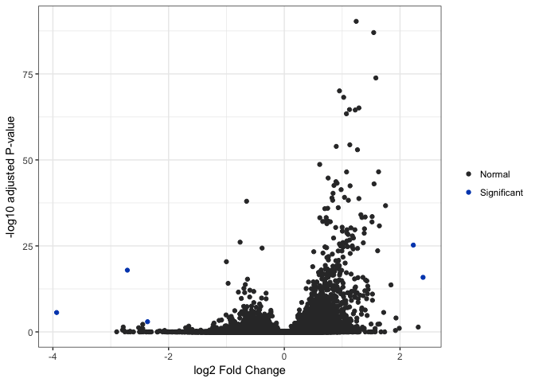<!-- -->

```r
print(c1c3.plot)
```

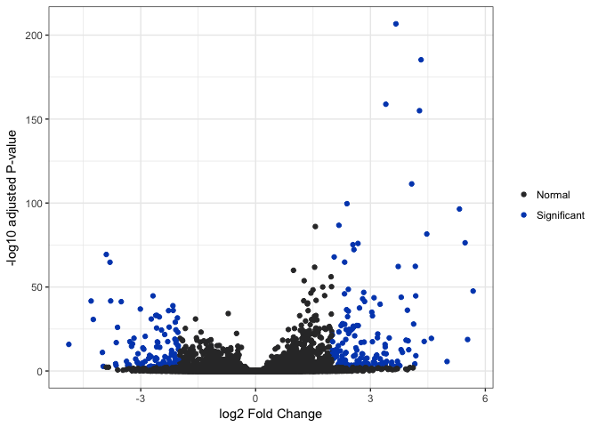<!-- -->

```r
print(c1c4.plot)
```

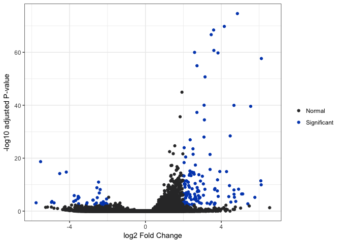<!-- -->

```r
print(c2c3.plot)
```

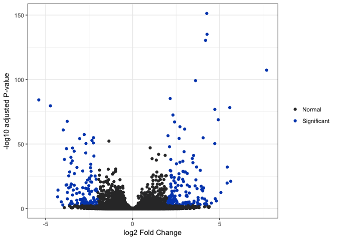<!-- -->

```r
print(c2c4.plot)
```

<!-- -->

```r
print(c3c4.plot)
```

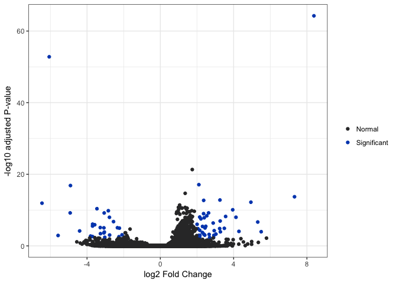<!-- -->

## References
[1]: https://www.biorxiv.org/content/early/2017/09/22/191395
Maciej Daniszewski, Anne Senabouth, Quan Nguyen, Duncan E Crombie, Samuel W Lukowski, Tejal Kulkarni, Donald J Zack, Alice Pebay, Joseph E Powell, Alex Hewitt, Single Cell RNA Sequencing of stem cell-derived retinal ganglion cells. bioRxiv 191395; doi: https://doi.org/10.1101/191395

[2]: https://f1000research.com/articles/5-2122/v2
Lun ATL, McCarthy DJ and Marioni JC. A step-by-step workflow for low-level analysis of single-cell RNA-seq data with Bioconductor [version 2; referees: 3 approved, 2 approved with reservations]. F1000Research 2016, 5:2122 (doi: 10.12688/f1000research.9501.2)

[3]: https://www.nature.com/articles/ncomms14049
Zheng, G. X. Y. et al. Massively parallel digital transcriptional profiling of single cells. Nat. Commun. 8, 14049 doi: 10.1038/ncomms14049 (2017).

[4]: https://bioconductor.org/packages/release/bioc/html/scater.html
McCarthy DJ, Campbell KR, Lun ATL and Wills QF (2017). “Scater: pre-processing, quality control, normalisation and visualisation of single-cell RNA-seq data in R.” Bioinformatics, 14 Jan. doi: 10.1093/bioinformatics/btw777, http://dx.doi.org/10.1093/bioinformatics/btw777.

[5]: https://bioconductor.org/packages/release/bioc/vignettes/scran/inst/doc/scran.html
Lun ATL, McCarthy DJ and Marioni JC (2016). “A step-by-step workflow for low-level analysis of single-cell RNA-seq data with Bioconductor.” F1000Res., 5, pp. 2122.
